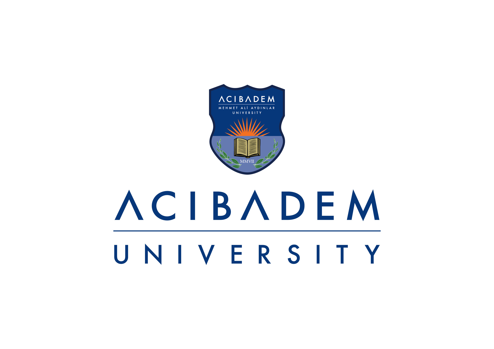
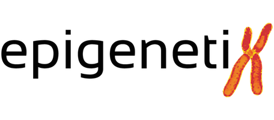
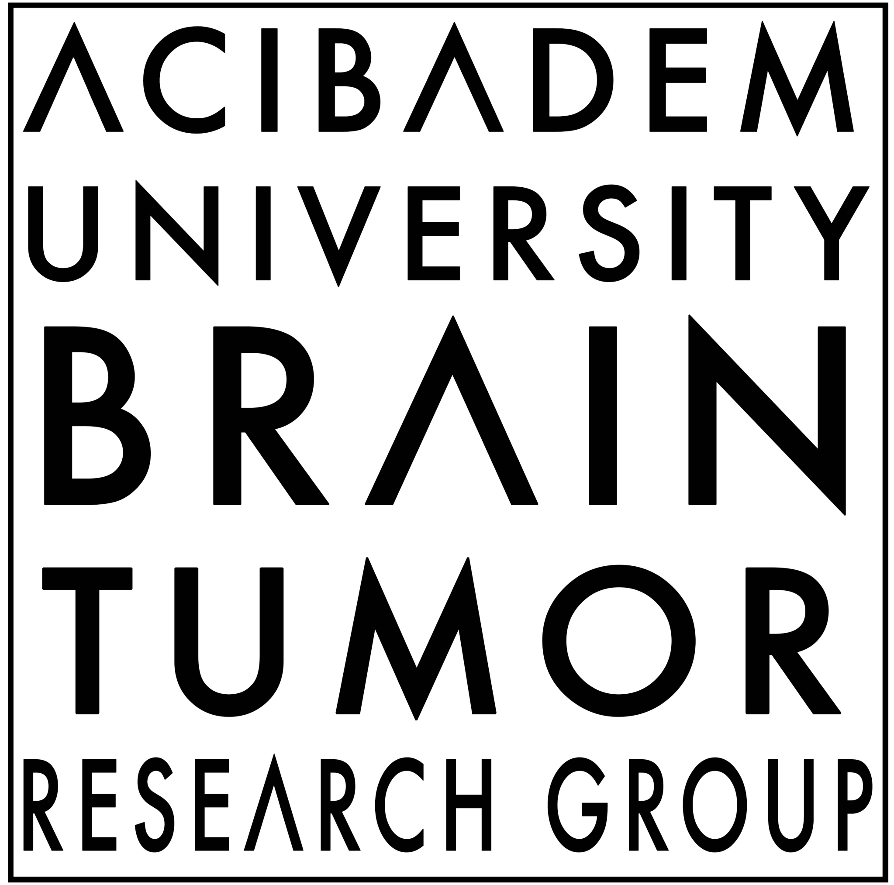

```{r setup, include=FALSE}
library(tibble)
library(knitr)

opts_chunk$set(echo = FALSE, warning = FALSE, message = FALSE)
```

I'm an MD-PhD professional in bioinformatics with a medical degree from Acibadem University in 2015, postdoctoral experience at Yale University in 2016, followed by a PhD in Biostatistics and Bioinformatics in 2022. As of 2023, I've been working as a Bioinformatics Engineer at Genomics England, where I focus on maintaining and enhancing software for the cancer genomic medicine service.

My CV (PDF) is also available [here](./CV_doc/egeulgen_CV.pdf)

# Experience


<script>
  $(document).ready(function(){
    $('.experience-carousel').slick({
      dots: true,
      infinite: true,
      speed: 300,
      slidesToShow: 1,
      adaptiveHeight: true
    });
  });
</script>

```{css, echo=FALSE}
.columns {
  display: flex;
  align-items: center;
}
.column {
  display: flex;
  flex-direction: column;
  margin-right: 20px; 
}
```


:::: {.columns}
::: {.column width="20%"}

:::
::: {.column width="80%"}
### Bioinformatics Engineer - Genomics England
#### 2023-
Developing features for and maintaining software for the cancer genomic medicine service.
:::
::::

---

:::: {.columns}
::: {.column width="20%"}

:::
::: {.column width="80%"}
### Lecturer - Acibadem University
#### 2021-2023
Worked as a lecturer for the undergrad and grad courses on biostatistics and bioinformatics topics.
:::
::::

---

:::: {.columns}
::: {.column width="20%"}

:::
::: {.column width="80%"}
### Bioinformatics Specialist - Epigenetiks
#### 2018-2023
Worked on developing and maintaining multiple whole exome sequencing-based analysis pipelines (cancer and rare disease applications) for the Istambul-based medical diagnostics company.
:::
::::

---

:::: {.columns}
::: {.column width="20%"}

:::
::: {.column width="80%"}
### Postdoctoral Associate - Yale University
#### 2016
Briefly worked as a post-doc associate at the Gunel Lab, Yale School of Medicine, where I had previously done multiple internships between 2011-2014. Research in neurogenetics, particularly malformations of cortical development and brain tumours, performing functional in-vitro analyses to investigate the effect of a SNP in the pathogenesis of gliomas.
:::
::::

---

:::: {.columns}
::: {.column width="20%"}

:::
::: {.column width="80%"}
### Bioinformatics Consultant - NeuroOncology Technologies
#### 2015-2023
Developed and maintained the Whole Exome Sequencing pipeline for the local medical diagnostics company based in Istanbul-Turkey. The pipeline allows for the identification of clinically-relevant genomics findings in brain tumours, especially regarding gliomas.
:::
::::

---

:::: {.columns}
::: {.column width="20%"}

:::
::: {.column width="80%"}
### Research Group Member - ACU Brain tumour Research Group
#### 2012-
Participate in research on brain tumours, particularly on gliomas. I assist in biostatistical as well as bioinformatics analyses, focusing on the integration of molecular biological and clinical data to improve diagnosis, prognosis and treatment of glioma.
:::
::::
