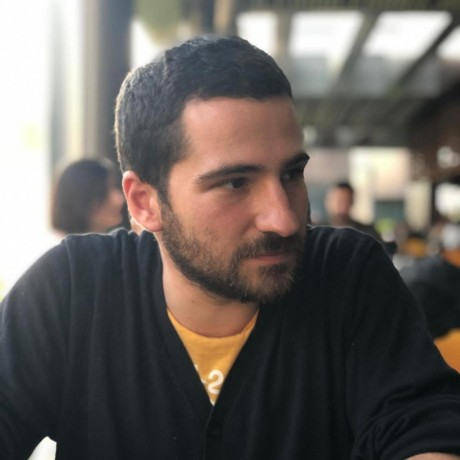

```{css, echo=FALSE}
.columns {
  display: flex;
  align-items: center;
}
.column {
  display: flex;
  flex-direction: column;
  margin-right: 20px; /* Adjust the margin as needed */
}
```

:::: {.columns}
::: {.column width="30%"}

```{css, echo=FALSE}
img {
  border-radius: 50%;
  clip-path: circle(50%);
}
```
:::
::: {.column width="70%"}
Welcome to my portfolio! I'm a passionate MD-PhD professional specializing in bioinformatics, blending a medical degree from Acibadem University with postdoctoral experience at Yale University and a recent PhD in Biostatistics and Bioinformatics (2022). Currently, I contribute to the field as a Bioinformatics Engineer at Genomics England, focusing on developing cutting-edge software for the cancer genomic medicine service.

Throughout my journey, I've been fueled by a love for learning, from exploring MOOCs to delving into the depths of the "science YouTube." Beyond the world of bioinformatics, I'm a self-proclaimed coffee-holic geek with a keen eye for aesthetics. While I **used to** be a photography enthusiast, my current focus remains on creating and enhancing software that impacts the forefront of medical research.

Explore my portfolio to learn more about my professional journey and the exciting projects I've been involved in. Feel free to connect with me on [LinkedIn](https://www.linkedin.com/in/ege-ulgen/) or drop me an [e-mail](mailto:Ege.Ulgen@genomicsengland.co.uk) to discuss collaborations, share insights, or simply chat about the fascinating intersection of medicine, bioinformatics, and creativity.
:::
::::


